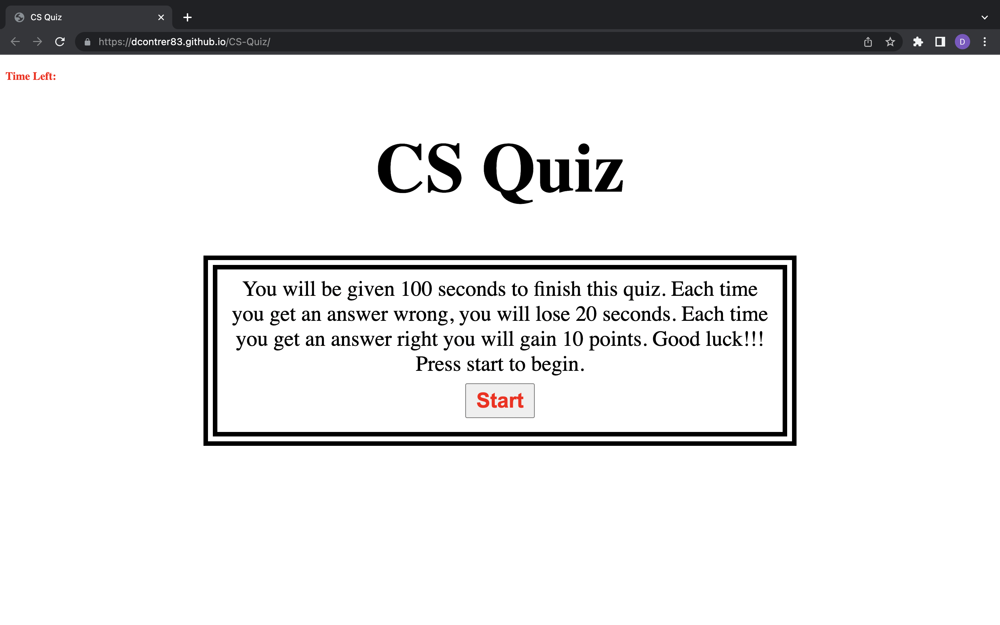
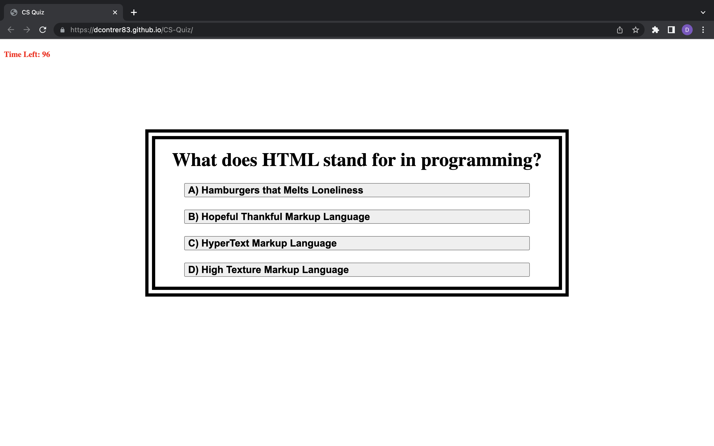
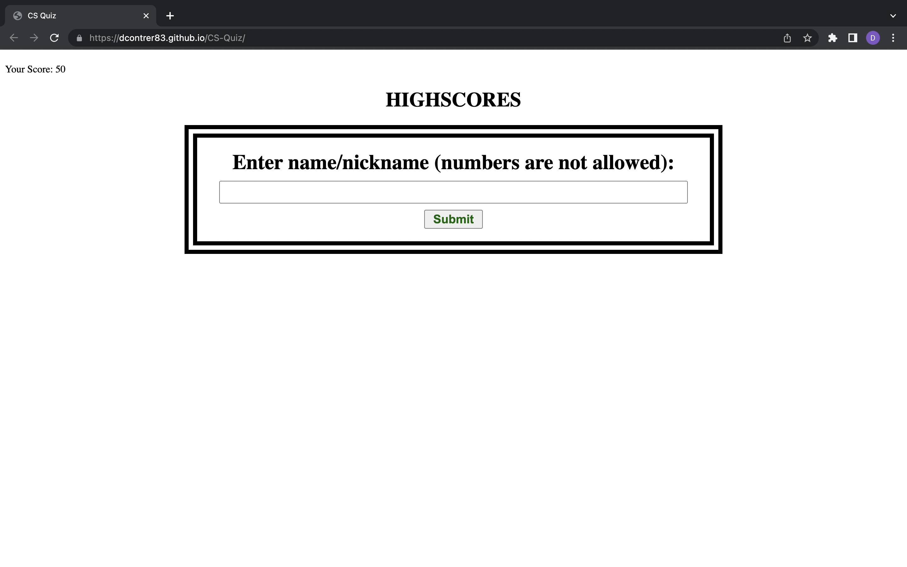
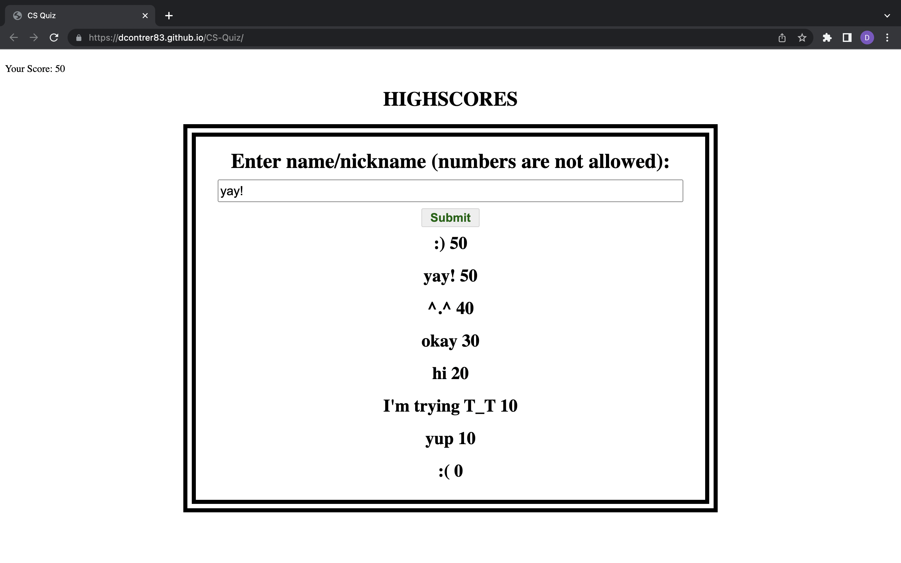

# CS-Quiz

<h2>Description</h2>
  

This webpage is a multiple choice quiz about Computer Science. It has five questions and a 100 second timer. Each time you get an answer right you gain 10 points. Each time you get an answer wrong, you lose 20 seconds. At the end your scores is shown and you are able to type in your name/nickname. Then you can compare your scores to others.

  
<h2>Screenshots<h2>

<h2>Link</h2>

<a href="https://dcontrer83.github.io/CS-Quiz/">CS Quiz</a>